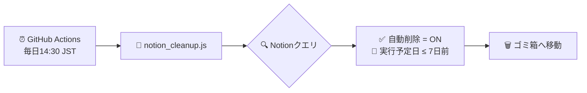

# 🗑️ Auto Trash for Notion

[](https://github.com/YoHo0122/auto_trash/actions/workflows/notion_cleanup.yml)
[](https://opensource.org/licenses/MIT)
[](https://nodejs.org/)

Notionのページを**自動的にゴミ箱へ移動**するツールです。
GitHub Actionsを使って定期実行し、指定した条件に一致するページを自動でクリーンアップします。

---

## 📋 目次

- [機能](#-機能)
- [仕組み](#-仕組み)
- [前提条件](#-前提条件)
- [セットアップ](#-セットアップ)
- [環境変数](#-環境変数)
- [使い方](#-使い方)
- [注意事項](#-注意事項)
- [ライセンス](#-ライセンス)

---

## ✨ 機能

- 📅 **日付ベースの自動削除**: 指定日数が経過したページを自動でゴミ箱へ
- ☑️ **チェックボックスによる対象指定**: 「自動削除」フラグがONのページのみ対象
- 🔄 **GitHub Actionsで定期実行**: 毎日自動でクリーンアップ
- 🧪 **DRY_RUNモード**: 実際に削除せずに対象ページを確認可能

---

## 🔧 仕組み



### 処理フロー

1. GitHub Actionsが毎日定時にワークフローを実行
2. Notion APIでデータソースをクエリ
3. 以下の条件に一致するページを取得：
   - `自動削除` プロパティが ✅ ON
   - `実行予定日` プロパティが 指定日数以前
4. 対象ページをゴミ箱へ移動

---

## 📝 前提条件

### 必要なもの

| 項目 | 説明 |
|------|------|
| Node.js | バージョン 20 以上 |
| Notionアカウント | ワークスペースの管理権限が必要 |
| Notionインテグレーション | APIトークンを取得するために必要 |
| Data Source ID | 対象のデータベースID |

### Notionデータベースの設定

対象のデータベースに以下のプロパティを追加してください：

| プロパティ名 | タイプ | 説明 |
|--------------|--------|------|
| `実行予定日` | 日付 | このページをいつ削除対象とするかの基準日 |
| `自動削除` | チェックボックス | ONにすると自動削除の対象になる |

#### プロパティ設定例

```
📋 データベース
├── タイトル (タイトル)
├── 実行予定日 (日付) ← 追加
├── 自動削除 (チェックボックス) ← 追加
└── その他のプロパティ...
```

> **💡 ヒント**: プロパティ名は環境変数でカスタマイズ可能です。`.github/workflows/notion_cleanup.yml` を編集してください。

---

## 🚀 セットアップ

### 1. リポジトリをフォーク

1. このリポジトリ右上の `Fork` をクリック
2. 「Create a new fork」画面で `Owner` とリポジトリ名を確認し、必要なら変更して `Create fork` をクリック

> **補足**: 表示文言は既定ブランチ名に応じて「Copy the DEFAULT branch only」などになる場合があります。

これで自分のアカウントにリポジトリがコピーされます。

### 2. Notion インテグレーション（トークン）を作成
1. [Notion インテグレーション](https://www.notion.so/profile/integrations) にアクセス
2. 「新しいインテグレーション」をクリック
3. 名前を入力（例：`Auto Trash Bot`）
4. 関連ワークスペースを選択
5. 「Create」をクリック
6. **内部インテグレーションシークレット** をコピー（これが `NOTION_TOKEN`）

### 3. データベースにインテグレーションを接続

1. 対象のNotionデータベースを開く
2. 右上の「...」メニューから「接続」を選択
3. 作成したインテグレーションを選択

### 4. Data Source IDを取得

データベースの設定から取得できます：

1. 対象のデータベースを開く
2. 右上の「データベースの設定」をクリック
3. 「**データソースを管理する**」を選択
4. データソースの「**•••**」メニューをクリック
5. 「**データソースID**」を選択してコピー

### 5. GitHub Secretsを設定

リポジトリの Settings → Secrets and variables → Actions → New repository secretで以下を追加：

| Name | Secret |
|----------|-----|
| `例:NOTION_TOKEN` | Notionインテグレーショントークン |
| `例:NOTION_DATA_SOURCE_ID` | 先ほどコピーしたData source ID |

### 6. GitHub Actionsを有効化

> **⚠️ 重要**: 新しく作成したリポジトリでは、GitHub Actionsを有効化する必要があります。

1. 作成したリポジトリの「**Actions**」タブを開く
2. 左側のワークフロー一覧から「**Auto Trash for Notion**」を選択
3. 「**Run workflow**」ボタンをクリック

> **💡 注意**: リポジトリに60日間アクティビティがないと、GitHub Actionsのスケジュール実行は自動的に無効化されます。

---

## 🔑 環境変数

| 変数名 | 必須 | デフォルト | 説明 |
|--------|------|-----------|------|
| `NOTION_TOKEN` | ✅ | - | Notionインテグレーショントークン |
| `NOTION_DATA_SOURCE_ID` | ✅ | - | Data source ID |
| `EXEC_DATE_PROPERTY` | - | `実行予定日` | 日付プロパティ名 |
| `AUTO_DELETE_PROPERTY` | - | `自動削除` | チェックボックスプロパティ名 |
| `DAYS` | - | `7` | 何日前のページを削除対象とするか |
| `DRY_RUN` | - | `true` | `true`の場合、削除せずログ出力のみ |

---

## 📖 使い方

### GitHub Actionsで自動実行
ワークフローは以下のスケジュールで自動実行されます：

- **毎日 14:30 JST**（05:30 UTC）

手動で実行する場合：

1. リポジトリの「Actions」タブを開く
2. 「Auto Trash for Notion」ワークフローを選択
3. 「Run workflow」をクリック

### DRY_RUNモード

初回実行時は必ず `DRY_RUN=true` で実行し、対象ページを確認してください。

ワークフローファイル（`.github/workflows/notion_cleanup.yml`）の以下の部分を編集します：

```yaml
env:
  DRY_RUN: "true"  # 確認時は true、本番時は false
```

出力例（GitHub Actions のログで確認）：
```
Cutoff (on_or_before): 2025-01-16
DRY_RUN: true
[DRY] would trash: xxxxxxxx-xxxx-xxxx-xxxx-xxxxxxxxxxxx
[DRY] would trash: yyyyyyyy-yyyy-yyyy-yyyy-yyyyyyyyyyyy
Matched: 2
Trashed: 0
```

確認後、`DRY_RUN: "false"` に変更して再度実行してください。

---

## ⚠️ 注意事項

### Notion APIの制限

- **完全削除は不可**: Notion APIはページをゴミ箱へ移動することしかできません。完全削除はNotionの管理画面から手動で行う必要があります。
- **ゴミ箱の保持期間**: ゴミ箱のページは30日後に自動で完全削除されます。

### 運用上の注意

- 🧪 **初回は必ずDRY_RUN**: 本番実行前に必ず `DRY_RUN=true` で対象ページを確認してください
- 🔐 **トークンの管理**: `NOTION_TOKEN(Integration Token)` は絶対に公開しないでください
- 📊 **実行ログの確認**: GitHub Actionsの実行ログで、どのページが削除されたか確認できます

---

## 📄 ライセンス

このプロジェクトは [MIT License](LICENSE) の下で公開されています。

```
MIT License

Copyright (c) 2025 YoHo0122

自由に使用・複製・改変・再配布が可能です。
```

---

## 🤝 貢献

Issue や Pull Request は大歓迎です！

### 貢献の方法

1. このリポジトリをフォーク
2. 新しいブランチを作成 (`git checkout -b feature/amazing-feature`)
3. 変更をコミット (`git commit -m 'Add amazing feature'`)
4. ブランチをプッシュ (`git push origin feature/amazing-feature`)
5. Pull Request を作成

### 歓迎する貢献

- 🐛 バグ報告・修正
- ✨ 新機能の提案・実装
- 📝 ドキュメントの改善
- 💡 アイデアや質問（Issue で気軽にどうぞ！）

---

<p align="center">
  Made with ❤️ for Notion users
</p>
